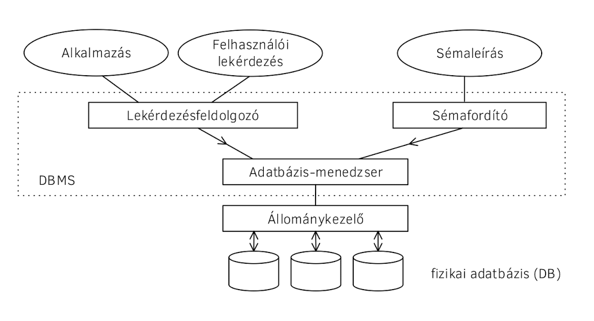

# Adatbázisok - tételek

## Tartalomjegyzék

1. [Adatbázisok alapjai](#Adatbázisok-alapjai)
   1. [Adat, információ, tudás. Metaadatok. Strukturált, szemistrukturált és nem strukturált adatok.](#Adat-információ,-tudás.-Metaadatok.-Strukturált,-szemistrukturált-és-nem-strukturált-adatok.)
   2. [Adatbázis-kezelő fogalma, feladatai, felépítése, használói](#Adatbázis-kezelő-fogalma-feladatai,-felépítése,-használói)
2. [A fizikai adatbázis](#A-fizikai-adatbázis)
   1. [Heap szervezés](#Heap-szervezés)
   2. [Hash-állományok](#Hash-állományok)
   3. [Indexelt állományok](#Indexelt-állományok)
   4. [Ritka indexek, B*-fák](#Ritka-indexek,-B*-fák)
   5. [Sűrű indexek, előnyök és hátrányok](#Sűrű-indexek,-előnyök-és-hátrányok)
   6. [Változó hosszúságú rekordok kezelése](#Változó-hosszúságú-rekordok-kezelése)
   7. [Részleges információ alapján történő keresés](#Részleges-információ-alapján-történő-keresés)
   8. [Több kulcs szerinti keresés támogatása](#Több-kulcs-szerinti-keresés-támogatása)
3. [A logikai adatbázis](#A-logikai-adatbázis)
   1. [Adatmodellek, modellezés](#Adatmodellek,-modellezés)
   2. [Az E-R modell és elemei](#Az-E-R-modell-és-elemei)
   3. [Az E-R diagram, ISA kapcsolatok, gyenge egyedhalmazok](#Az-E-R-diagram,-ISA-kapcsolatok,-gyenge-egyedhalmazok)
   4. [A relációs adatmodell: adatok strukturálása és műveletek](#A-relációs-adatmodell:-adatok-strukturálása-és-műveletek)
   5. [Relációalgebra](#Relációalgebra)
   6. [Sorkalkulus, oszlopkalkulus](#Sorkalkulus,-oszlopkalkulus)
   7. [Biztonságosság](#Biztonságosság)
4. [Lekérdezés-optimalizálás](#Lekérdezés-optimalizálás)
   1. [Relációs lekérdezések heurisztikus optimalizálása](#Relációs-lekérdezések-heurisztikus-optimalizálása)
   2. [Relációalgebrai kifejezések transzformációi, ekvivalens kifejezések](#Relációalgebrai-kifejezések-transzformációi,-ekvivalens-kifejezések)
   3. [Relációs lekérdezések költségbecslés alapú optimalizálása](#Relációs-lekérdezések-költségbecslés-alapú-optimalizálása)
   4. [Katalógusban tárolt információk](#Katalógusban-tárolt-információk)
   5. [A lekérdezés költsége: szelekció, indexelt szelekció, join műveletek és algoritmusok, egyéb műveletek](#A-lekérdezés-költsége-szelekció,-indexelt-szelekció,-join-műveletek-és-algoritmusok,-egyéb-műveletek)
   6. [Materializáció és pipelining](#Materializáció-és-pipelining)
   7. [A kiértékelési terv kiválasztása](#A-kiértékelési-terv-kiválasztása)
5. [Adatbázisok logikai tervezése](#Adatbázisok-logikai-tervezése)
   1. [Relációs adatbázis sémák tervezése E-R diagramból](#Relációs-adatbázis-sémák-tervezése-E-R-diagramból)
   2. [Anomáliák (módosítási, törlési, beszúrási)](#Anomáliák-(módosítási,-törlési,-beszúrási))
   3. [Adatbázis kényszerek, redundancia](#Adatbázis-kényszerek,-redundancia)
   4. [Funkcionális függőségek](#Funkcionális-függőségek)
   5. [Relációs sémák kulcsai](#Relációs-sémák-kulcsai)
   6. [Armstrong axiómái a funkcionális függőségekről](#Armstrong-axiómái-a-funkcionális-függőségekről)
   7. [Az első normálforma (1NF)](#Az-első-normálforma-(1NF))
   8. [A második normálforma (2NF)](#A-második-normálforma-(2NF))
   9. [A harmadik normálforma (3NF)](#A-harmadik-normálforma-(3NF))
   10. [A Boyce-Codd normálforma (BCNF)](#A-Boyce-Codd-normálforma-(BCNF))
6. [Tranzakció-kezelés](#Tranzakció-kezelés)
   1. [ACID tulajdonságok adatbázis-kezelő rendszerekben](#ACID-tulajdonságok-adatbázis-kezelő-rendszerekben)
   2. [Lost update, non-repetable read, phantom read, dirty data](#Lost-update,-non-repetable-read,-phantom-read,-dirty-data)
   3. [Problémák a zárakkal: pattok és éhezés](#Problémák-a-zárakkal:-pattok-és-éhezés)
   4. [Ütemezések fajtái](#Ütemezések-fajtái)
   5. [Tranzakció modellek](#Tranzakció-modellek)
   6. [Kétfázisú zárolás (2PL)](#Kétfázisú-zárolás-(2PL))
   7. [A fa protokoll](A-fa-protokoll)
   8. [A figyelmeztető protokoll](#A-figyelmeztető-protokoll)
   9. [Tranzakcióhibák kezelése, commit pont](#Tranzakcióhibák-kezelése,-commit-pont)
   10. [Szigorú kétfázisú protokoll (szigorú 2PL)](#Szigorú-kétfázisú-protokoll-(szigorú-2PL))
   11. [Agresszív és konzervatív protokollok](#Agresszív-és-konzervatív-protokollok)
   12. [Védekezés rendszerhibák ellen](#Védekezés-rendszerhibák-ellen)
   13. [Hatékonysági kérdések](#Hatékonysági-kérdések)
   14. [A redo protokoll: naplózás és helyreállítás](#A-redo-protokoll-naplózás-és-helyreállítás)
   15. [Ellenőrzési pontok (checkpointing)](#Ellenőrzési-pontok-(checkpointing))
   16. [Időbélyeges tranzakciókezelés R/W modellben](#Időbélyeges-tranzakciókezelés-R/W-modellben)
   17. [Az időbélyeges R/W modell és a 2PL összehasonlítása](#Az-időbélyeges-R/W-modell-és-a-2PL-összehasonlítása)
   18. [Tranzakcióhibák és az időbélyegek](#Tranzakcióhibák-és-az-időbélyegek)
   19. [Verziókezelés időbélyegek mellett (MVCC)](#Verziókezelés-időbélyegek-mellett-(MVCC))

## Adatbázisok alapjai

### Adat, információ, tudás. Metaadatok. Strukturált, szemistrukturált és nem strukturált adatok.

Adat, információ, tudás: 🧓🏼 G4jd0s stuff

#### Metaadatok

A tárolt adatok sémáját leíró adatok (pl egy embert a neve, életkora és magassága jellemzi, ahol a neve egy max 128 karakteres UTF8 string, az életkora egy 4 byte-os `int`, a magassága pedig egy `real` ).

#### Adatok strukturáltsága

Azt jelenti, hogy az adatbázisban tárolt adatok mennyire vann szétbontva, és az adatbázissal mennyire részletesen lehet lekérdezni/hozzáférni.

Nem strukturált adatokra példa, ha az összes adatot szövegként egy hatalmas XML file-ban lenne tárolva, így viszont az adatbázis max. szöveg-manipulációs függvényekkel férhet hozzá.

Szemi-strukturált adatokra példa, ha pl. egy blogon a posztok JSON-ban string-ként vannak tárolva, de a pl. publikálás dátuma, szerzője és a poszt címe már külön mező a posztokat tároló tábla sémájában. 

Teljesen strukturált adatoknál minden "atomi" adat (tehát amik külön már nem lennének értelmesek, pl számok, stringek, dátumok, koordináták) külön mező.

### Adatbázis-kezelő fogalma, feladatai, felépítése, használói

#### Adatbázis-kezelő fogalma

Az a "program" (és a hozzá tartozó infrastruktúra), ami a logikai adatbázist implementálja. Része a DDL és DML nyelvek implementációja, az adatbázis-menedzser, és az állománykezelő.

#### Az adatbázis-kezelő feladatai

- Az adatbázis-séma értelmezése és tárolása (DDL)
- A felhasználói lekérdezések végrehajtása (DML)
- A fizikai tárolás megvalósítása
- Adatvédelem: a felhasználók privilégiumok szerinti elkülönítése
- Adatbiztonság: az adatok extrém csapások után is maradjanak elérhetőek
- Integritás: az adatbázisban tárolt adatok mindig legyenek "helyesek". A helyesség arra utal, hogy 1) egy adott mezőhöz tartozó kényszerek be legyenek tartva 2) referenciális integritás megmaradjon (pl idegen kulcsok esetén)
- Szinkronitás: több felhasználós működés esetén ne legyen "áthallás" a felhasználók között

#### Tipikus felhasználók

Lásd jegyzet 1.3

#### Az adatbázis-kezelő (logikai) felépítése

(forrás: jegyzet)

A rétegmodellben a rétegek lehetővé teszik, hogy a mindegyik réteg csak a saját szomszédainak interface-étől függjön, azaz pl a keresési implementációja akármilyen fizikai hardverrel együtt tud működni (pl in-memory vagy disk alapú).

## A fizikai adatbázis

Egy adatbázis fizikai része lehet diszkrezidens vagy memóriarezidens. A fizikai szervezés implementálásában

- keresés
- beszúrás
- törlés
- módosítás

műveletek hatékonysága az elsődleges szempont.

### Heap szervezés

### Hash-állományok

### Indexelt állományok

### Ritka indexek, B*-fák

### Sűrű indexek, előnyök és hátrányok

### Változó hosszúságú rekordok kezelése

(jegyzet: 3.4)

Ez a szituáció akkor állhat elő, ha egy mező változó hosszúságú lehet (pl egy név stringben), vagy ismétlődő mezőcsoport van egy rekordban. Általában a fix hosszúságú mezők a rekord elején, a változó hosszúságúak pedig a végén találhatóak, így a rekord eleje garantáltan fix hosszúságú marad. A változó hosszúságú mezők beillesztésére két megközelítés létezik: a konkrét adat egy pointerrel van helyettesítve, ami egy másik állományba mutat (így ez a mező is fix hosszúságúvá tehető), vagy a maximális lehetséges mennyiségű hely le van fogalva előre, és abba íródik az adat. Ezen kívül ennek a két megközelítésnek a hibridjét is lehet alkalmazni.

### Részleges információ alapján történő keresés

(jegyzet: 3.5)

(Feltételezzük, hogy a mezők egyike sem kulcs.)

Ebben az esetben az egyik megoldás, hogy több, vagy egyenesen minden mezőre építünk indexeket, és ez után sima indexelt keresésként kezeljük a problémát. Ez a megoldás elég költséges az indexek tárolása és karbantartása miatt.

Egy másik megoldás a partícionált hash függvények alkalmazása. Ennek alapötlete az, hogy a hash a rekord mezőiből külön külön van kalkulálva, úgy, hogy az összefűzött értéke a vöröd sorszámát adja. Ha egyes rekordok nem ismertek, az azokhoz tartozó bitminta "tetszőleges" lesz, és minden vödröt végig kell nézni, ahol passzolnak a hash ismert részei.

### Több kulcs szerinti keresés támogatása

TODO

## A logikai adatbázis

### Adatmodellek, modellezés

### Az E-R modell és elemei

### Az E-R diagram, ISA kapcsolatok, gyenge egyedhalmazok

### A relációs adatmodell: adatok strukturálása és műveletek

### Relációalgebra

### Sorkalkulus, oszlopkalkulus

### Biztonságosság

## Lekérdezés-optimalizálás

### Relációs lekérdezések heurisztikus optimalizálása

### Relációalgebraikifejezések transzformációi, ekvivalens kifejezések

### Relációs lekérdezések költségbecslés alapú optimalizálása

### Katalógusban tárolt információk

### A lekérdezés költsége: szelekció, indexelt szelekció, join műveletek és algoritmusok, egyéb műveletek

### Materializáció és pipelining

### A kiértékelési terv kiválasztása

## Adatbázisok logikai tervezése

### Relációs adatbázis sémák tervezése E-R diagramból

### Anomáliák (módosítási,  törlési, beszúrási)

### Adatbázis kényszerek, redundancia

### Funkcionális függőségek

### Relációs sémák kulcsai

### Armstrong axiómái a funkcionális függőségekről

### Az első normálforma (1NF)

### A második normálforma (2NF)

### A harmadik normálforma (3NF)

### A Boyce-Codd normálforma (BCNF)

## Tranzakció-kezelés

### ACID tulajdonságok adatbázis-kezelő rendszerekben

### Lost update, non-repetable read, phantom read, dirty data

### Problémák a zárakkal: pattok és éhezés

### Ütemezések fajtái

### Tranzakció modellek

### Kétfázisú zárolás (2PL)

### A fa protokoll

### A figyelmeztető protokoll

### Tranzakcióhibák kezelése, commit pont

### Szigorú kétfázisú protokoll (szigorú 2PL)

### Agresszív és konzervatív protokollok

### Védekezés rendszerhibák ellen

### Hatékonysági kérdések

### A redo protokoll: naplózás és helyreállítás

### Ellenőrzési pontok (checkpointing)

### Időbélyeges tranzakciókezelés R/W modellben

### Az időbélyeges R/W modell és a 2PL összehasonlítása

### Tranzakcióhibák és az időbélyegek

### Verziókezelés időbélyegek mellett (MVCC)
