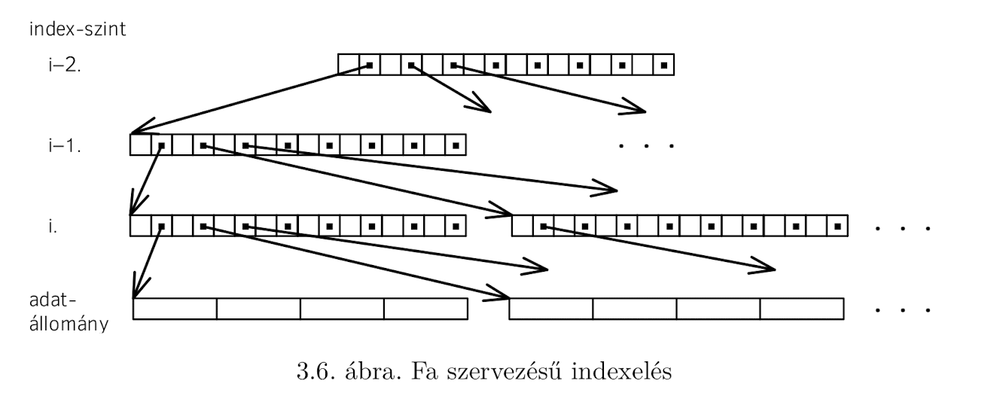
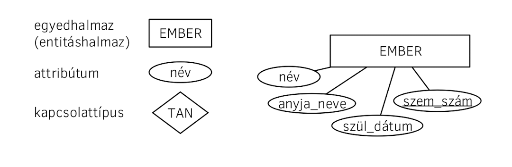
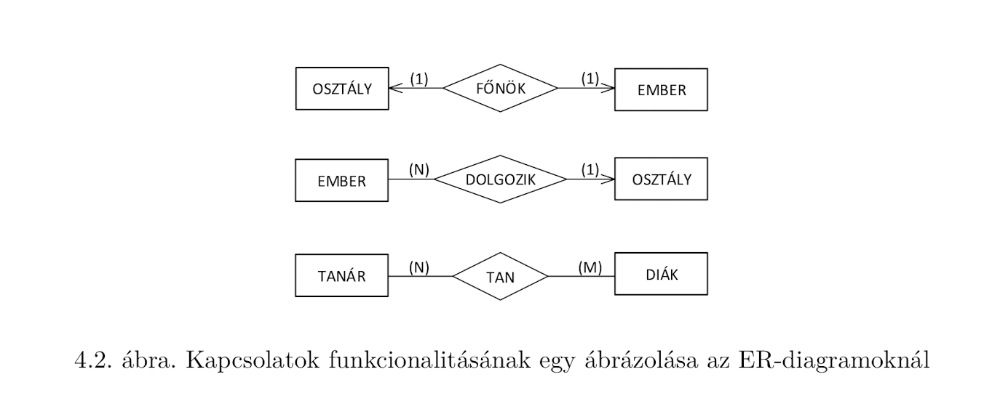
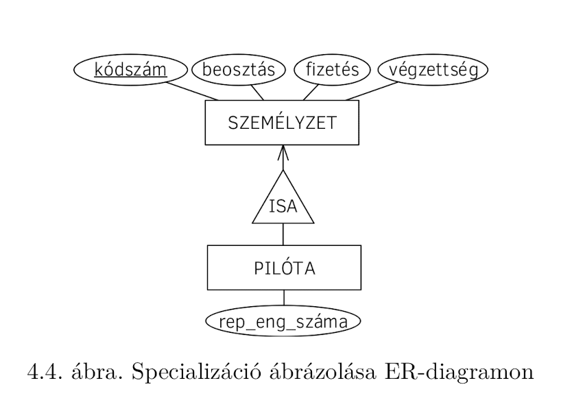
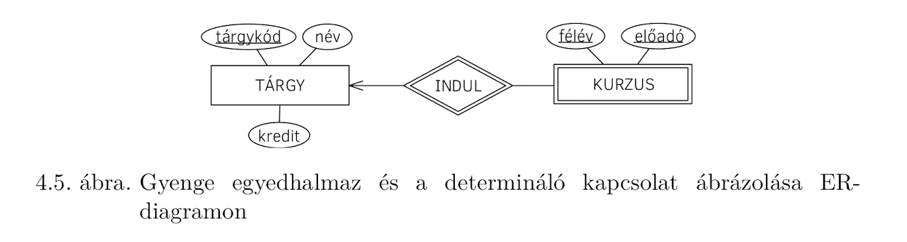

# Adatbázisok - tételek

## Tartalomjegyzék

1. [Adatbázisok alapjai](#Adatbázisok-alapjai)
   1. [Adat, információ, tudás. Metaadatok. Strukturált, szemistrukturált és nem strukturált adatok.](#adat-információ-tudás-metaadatok-strukturált-szemistrukturált-és-nem-strukturált-adatok)
   2. [Adatbázis-kezelő fogalma, feladatai, felépítése, használói](#adatbázis-kezelő-fogalma-feladatai-felépítése-használói)
2. [A fizikai adatbázis](#a-fizikai-adatbázis)
   1. [Heap szervezés](#heap-szervezés)
   2. [Hash-állományok](#hash-állományok)
   3. [Indexelt állományok](#indexelt-állományok)
   4. [Ritka indexek](#ritka-indexek)
   5. [B*-fák](#b-fák)
   6. [Sűrű indexek, előnyök és hátrányok](#sűrű-indexek-előnyök-és-hátrányok)
   7. [Változó hosszúságú rekordok kezelése](#változó-hosszúságú-rekordok-kezelése)
   8. [Részleges információ alapján történő keresés](#részleges-információ-alapján-történő-keresés)
   9. [Több kulcs szerinti keresés támogatása](#több-kulcs-szerinti-keresés-támogatása)
3. [A logikai adatbázis](#a-logikai-adatbázis)
   1. [Adatmodellek, modellezés](#adatmodellek-modellezés)
   2. [Az E-R modell és elemei](#az-e-r-modell-és-elemei)
   4. [A relációs adatmodell: adatok strukturálása és műveletek](#a-relációs-adatmodell-adatok-strukturálása-és-műveletek)
   5. [Relációalgebra](#relációalgebra)
   6. [Sorkalkulus, oszlopkalkulus](#sorkalkulus-oszlopkalkulus)
   7. [Biztonságosság](#biztonságosság)
4. [Lekérdezés-optimalizálás](#lekérdezés-optimalizálás)
   1. [Katalógusban tárolt információk](#katalógusban-tárolt-információk)
   2. [A lekérdezés költsége: szelekció, indexelt szelekció, join műveletek és algoritmusok, egyéb műveletek](#a-lekérdezés-költsége-szelekció-indexelt-szelekció-join-műveletek-és-algoritmusok-egyéb-műveletek)
   3. [Materializáció és pipelining](#materializáció-és-pipelining)
   4. [Relációalgebrai kifejezések transzformációi, ekvivalens kifejezések](#relációalgebrai-kifejezések-transzformációi,-ekvivalens-kifejezések)
   5. [A kiértékelési terv kiválasztása](#a-kiértékelési-terv-kiválasztása)
   6. [Relációs lekérdezések költségbecslés alapú optimalizálása](#relációs-lekérdezések-költségbecslés-alapú-optimalizálása)
   7. [Relációs lekérdezések heurisztikus optimalizálása](#relációs-lekérdezések-heurisztikus-optimalizálása)
5. [Adatbázisok logikai tervezése](#adatbázisok-logikai-tervezése)
   1. [Relációs adatbázis sémák tervezése E-R diagramból](#relációs-adatbázis-sémák-tervezése-e-r-diagramból)
   2. [Anomáliák (módosítási, törlési, beszúrási)](#anomáliák-(módosítási-törlési-beszúrási))
   3. [Adatbázis kényszerek, redundancia](#adatbázis-kényszerek-redundancia)
   4. [Funkcionális függőségek](#funkcionális-függőségek)
   5. [Relációs sémák kulcsai](#relációs-sémák-kulcsai)
   6. [Armstrong axiómái a funkcionális függőségekről](#armstrong-axiómái-a-funkcionális-függőségekről)
   7. [Az első normálforma (1NF)](#az-első-normálforma-(1NF))
   8. [A második normálforma (2NF)](#a-második-normálforma-(2NF))
   9. [A harmadik normálforma (3NF)](#a-harmadik-normálforma-(3NF))
   10. [A Boyce-Codd normálforma (BCNF)](#a-Boyce-Codd-normálforma-(BCNF))
6. [Tranzakció-kezelés](#tranzakció-kezelés)
   1. [ACID tulajdonságok adatbázis-kezelő rendszerekben](#acid-tulajdonságok-adatbázis-kezelő-rendszerekben)
   2. [Ütemezések fajtái](#ütemezések-fajtái)
   3. [Lost update, non-repetable read, phantom read, dirty data](#lost-update-non-repetable-read-phantom-read-dirty-data)
   4. [Problémák a zárakkal: pattok és éhezés](#problémák-a-zárakkal-pattok-és-éhezés)
   5. [Tranzakció modellek](#tranzakció-modellek)
   6. [Kétfázisú zárolás (2PL)](#kétfázisú-zárolás-(2PL))
   7. [A fa protokoll](#a-fa-protokoll)
   8. [A figyelmeztető protokoll](#a-figyelmeztető-protokoll)
   9. [Tranzakcióhibák kezelése, commit pont](#tranzakcióhibák-kezelése-commit-pont)
   10. [Szigorú kétfázisú protokoll (szigorú 2PL)](#szigorú-kétfázisú-protokoll-(szigorú-2PL))
   11. [Agresszív és konzervatív protokollok](#agresszív-és-konzervatív-protokollok)
   12. [Védekezés rendszerhibák ellen](#védekezés-rendszerhibák-ellen)
   13. [Hatékonysági kérdések](#hatékonysági-kérdések)
   14. [A redo protokoll: naplózás és helyreállítás](#a-redo-protokoll-naplózás-és-helyreállítás)
   15. [Ellenőrzési pontok (checkpointing)](#ellenőrzési-pontok-(checkpointing))
   16. [Időbélyeges tranzakciókezelés R/W modellben](#időbélyeges-tranzakciókezelés-R/W-modellben)
   17. [Az időbélyeges R/W modell és a 2PL összehasonlítása](#az-időbélyeges-R/W-modell-és-a-2PL-összehasonlítása)
   18. [Tranzakcióhibák és az időbélyegek](#tranzakcióhibák-és-az-időbélyegek)
   19. [Verziókezelés időbélyegek mellett (MVCC)](#verziókezelés-időbélyegek-mellett-(MVCC))

## Adatbázisok alapjai

### Adat, információ, tudás. Metaadatok. Strukturált, szemistrukturált és nem strukturált adatok.

Adat, információ, tudás: 🧓🏼 G4jd0s stuff

#### Metaadatok

A tárolt adatok sémáját leíró adatok (pl egy embert a neve, életkora és magassága jellemzi, ahol a neve egy max 128 karakteres UTF8 string, az életkora egy 4 byte-os `int`, a magassága pedig egy `real` ).

#### Adatok strukturáltsága

Azt jelenti, hogy az adatbázisban tárolt adatok mennyire vann szétbontva, és az adatbázissal mennyire részletesen lehet lekérdezni/hozzáférni.

Nem strukturált adatokra példa, ha az összes adatot szövegként egy hatalmas XML file-ban lenne tárolva, így viszont az adatbázis max. szöveg-manipulációs függvényekkel férhet hozzá.

Szemi-strukturált adatokra példa, ha pl. egy blogon a posztok JSON-ban string-ként vannak tárolva, de a pl. publikálás dátuma, szerzője és a poszt címe már külön mező a posztokat tároló tábla sémájában. 

Teljesen strukturált adatoknál minden "atomi" adat (tehát amik külön már nem lennének értelmesek, pl számok, stringek, dátumok, koordináták) külön mező.

### Adatbázis-kezelő fogalma, feladatai, felépítése, használói

#### Adatbázis-kezelő fogalma

Az a "program" (és a hozzá tartozó infrastruktúra), ami a logikai adatbázist implementálja. Része a DDL és DML nyelvek implementációja, az adatbázis-menedzser, és az állománykezelő.

#### Az adatbázis-kezelő feladatai

- Az adatbázis-séma értelmezése és tárolása (DDL)
- A felhasználói lekérdezések végrehajtása (DML)
- A fizikai tárolás megvalósítása
- Adatvédelem: a felhasználók privilégiumok szerinti elkülönítése
- Adatbiztonság: az adatok extrém csapások után is maradjanak elérhetőek
- Integritás: az adatbázisban tárolt adatok mindig legyenek "helyesek". A helyesség arra utal, hogy 1) egy adott mezőhöz tartozó kényszerek be legyenek tartva 2) referenciális integritás megmaradjon (pl idegen kulcsok esetén)
- Szinkronitás: több felhasználós működés esetén ne legyen "áthallás" a felhasználók között

#### Tipikus felhasználók

Lásd jegyzet 1.3

#### Az adatbázis-kezelő (logikai) felépítése


(forrás: jegyzet)

A rétegmodellben a rétegek lehetővé teszik, hogy a mindegyik réteg csak a saját szomszédainak interface-étől függjön, azaz pl a keresési implementációja akármilyen fizikai hardverrel együtt tud működni (pl in-memory vagy disk alapú).

## A fizikai adatbázis

Egy adatbázis fizikai része lehet diszkrezidens vagy memóriarezidens. A fizikai szervezés implementálásában

- keresés
- beszúrás
- törlés
- módosítás

műveletek hatékonysága az elsődleges szempont.

A fizikai tárolásban használt "elemek" hierarchiája valami ilyesmi:

- a teljes adatbázis tárolására használt háttértár
  - file-ok: az oprendszer kezeli őket
    - blokkok
      - rekordok

A blokkok mérete kilobájtokban mérhető méretű, csak egy relatíve alacsony, fix mennyiségű tárolható egyszerre az operatív tárban (RAM-ban). A fenti 4 művelet hatékonyságát az határozza meg, hogy egy blokk tartalmát hányszor kell a háttértárból kiolvasni. A blokkok rendelkeznek egy fejléccel, ahol a tartalmazott rekordokra vonatkozó metaadatok tárolódnak (pl melyik rekord van törölve).

A rekordok [header, record*] struktúrával rendelkeznek. Egy rekord szabad, ha az adatbázisban nincs rá mutató pointer (ellenkező esetben kötött). A rekordok tartalmazhatnak ismétlődő hosszúságú mezőket.

Jelölések:

```
b: blokkméret (fejléc nélkül)
s_r: az r állomány rekordmérete
n_r: az r állomány rekordjainak száma
f_r: az r állományban egy blokkban elhelyezkedő rekordok száma (blocking factor): floor(b / s_r)
b_r: az r állomány által elfoglalt blokkok száma: ceil(n_r / f_r)
```

### Heap szervezés

Ebben az esetben ay adatok mindenféle segédstruktúra nélkül, "kupacban" vannak tárolva. A 4 művelet a következőképpen alakul:

- Keresés: lineáris kereséssel minden blokkot végig kell nézni a keresett rekordokért. Mivel a legjobb esetben egyből meglesz a keresett rekord, legrosszabb esetben pedig az utolsóként sorra kerülő blokkban van, átlagosan `blokkok száma / 2` blokkművelet után lesz meg.
- Törlés: a kereséshez hasonlóan.
- Beszúrás: a rekordok egyediségét biztosító mezőknek valóban egyedinek kell maradniuk. A beszúrás elvégzésekor vagy egy törölt rekord helyére lehet beírni az újat, vagy az állomány végére kell beszúrni (esetleg új blokkba).
- Módosítás: kb keresés + törlés + beszúrás jellemzőt hordozza. Minden esetben gondoskodni kell arról, hogy két megkülönböztethetetlen rekord ne kerüljön az adatbázisba.

### Hash-állományok

Ebben a megközelítésben egy rekord kulcsmezőiből vödrös hasheléssel megkapjuk a rekordot tartalmazó blokk címét tartalmazó vödröt.

Műveletek:

- Keresés: A hash függvényel megkapjuk azokat a blokkokat, amik potenciálisan tartalmazhatják a rekordot. Ezeket a blokkokat lineárisan végigolvasva megkapjuk a keresett rekordot. Ekkor az elérés ideje `1/(2B)` lesz, ahol `B` a hash függvény által használt vödrök száma.
- Beszúrás: az állomány beszúrása a keresésnek megfelelően történik (plusz egyediségi garanciák). Ha csak új blokkba lehet elhelyezni a beszúrt rekordot, akkor az új blokkot hozzá kell fűzni a megfelelő vödörben tárolt blokkokhoz.
- Törlés: beszúrás, csak fordítva
- Módosítás: ha nem érint kulcsmezőt, akkor semmi extra (mint a heap-ben). Ha viszont igen, akkor a vödör katalógust frissíteni kell, ami több műveletet is maga után vonhat (mivel lehet, hogy a rekordot csak új blokkba lehet beilleszteni).

### Indexelt állományok

Az alapötlet az, hogy a keresés kulcsát egy külön állományban tároljuk, ahonnan egy mutató a rekordot tartalmazó blokkra mutat. Az indexállományban a kulcsnak és a mutatónak fix mérete van, így az indexállomány `blocking_factor`a `f_i = floor(b / (k + p))` lesz, ahol `k` a kulcsmező mérete és `p` a mutató mérete.

Az indexelt állomány rendezve van tárolva.

Az indexállományoknak két gyakori típusa lehet:

- sűrű index: az indexállományban minden indexelt rekordhoz tartozik egy bejegyzés
- ritka index: csak az indexelt rekordok egy csoportjához rendel egy bejegyzést az indexállományban

### Ritka indexek

- Keresés: bináris kereséssel megkeressük a megfelelő bejegyzést az indexállományban, majd a mutatott blokkból kiolvassuk a keresett rekordot.
- Beszúrás: frissíteni kell az indexállományt.
- Törlés: frissíteni kell az indexállományt.
- Módosítás: Ha kulcsot érint a módosítás, egy beszúrás + törlés kombóval kell frissíteni az indexállományt.

### B*-fák

Alapötlet: az index is indexelve van: "Az i − 1. index egyidejűleg ritka indexe az i. indexnek és adatállománya az i − 2. indexnek".




### Sűrű indexek, előnyök és hátrányok

Előnyök:

- nem kell rendezetten tartani az adatállományt
- támogatja a több kulcs szerinti keresést
- meggyorsíthatja a rekordelérést, mert a ritka index mérete jóval kisebb is lehet, mint sűrű index nélkül
- az adatállomány rekordjai (csaknem) szabadokká tehetők, ha minden további rekordhivatkozás a sűrű indexen keresztül történik (egyetlen mutatót kell megváltoztatni

Hátrányok:

- Sok helyet foglal
- +1 indirekció a rekord kiolvasásához
- karbantartási overhead

Műveletek: mintha egy hashtable-t használnánk

### Változó hosszúságú rekordok kezelése

(jegyzet: 3.4)

Ez a szituáció akkor állhat elő, ha egy mező változó hosszúságú lehet (pl egy név stringben), vagy ismétlődő mezőcsoport van egy rekordban. Általában a fix hosszúságú mezők a rekord elején, a változó hosszúságúak pedig a végén találhatóak, így a rekord eleje garantáltan fix hosszúságú marad. A változó hosszúságú mezők beillesztésére két megközelítés létezik: a konkrét adat egy pointerrel van helyettesítve, ami egy másik állományba mutat (így ez a mező is fix hosszúságúvá tehető), vagy a maximális lehetséges mennyiségű hely le van fogalva előre, és abba íródik az adat. Ezen kívül ennek a két megközelítésnek a hibridjét is lehet alkalmazni.

### Részleges információ alapján történő keresés

(jegyzet: 3.5)

(Feltételezzük, hogy a mezők egyike sem kulcs.)

Ebben az esetben az egyik megoldás, hogy több, vagy egyenesen minden mezőre építünk indexeket, és ez után sima indexelt keresésként kezeljük a problémát. Ez a megoldás elég költséges az indexek tárolása és karbantartása miatt.

Egy másik megoldás a partícionált hash függvények alkalmazása. Ennek alapötlete az, hogy a hash a rekord mezőiből külön külön van kalkulálva, úgy, hogy az összefűzött értéke a vöröd sorszámát adja. Ha egyes rekordok nem ismertek, az azokhoz tartozó bitminta "tetszőleges" lesz, és minden vödröt végig kell nézni, ahol passzolnak a hash ismert részei.

### Több kulcs szerinti keresés támogatása

Sűrű index használatával megvalósítható.

## A logikai adatbázis

### Adatmodellek, modellezés

Adatmodell:

- formalizált jelölésrendszer az adatok, adatkapcsolatok leírására
- műveletek az adatokon

Modellezés: a valóság leképzése valamilyen egyszerűsített formalizmusra

### Az E-R modell és elemei

Az ER modell nem teljes adatmodell, mivel az adatműveletek nincsek benne definiálva.

Elemei:

- Egyedtípusok
- Attribútumtípusok
- Kapcsolattípusok

#### Entitások (4.2.1.1)

> A valós világban létező, logikai vagy fizikai szempontból saját léttel rendelkező dolog, amelyről adatokat tárolunk.

Tulajdonságok

> Az entitásokat jellemzi, amelyen vagy amelyeken keresztül az entitások megkülönböztethetők.

Egyedhalmaz

> Az azonos attribútumtípusokkal jellemzett egyedek összessége.

#### Kapcsolatok

> Entitások névvel ellátott viszonya.
>
> Kapcsolatok funcionalitása: pl. egy-egy, egy-több vagy több-több kapcsolat

#### Kulcs

> Az ER-modellezésnél az attribútumoknak azt a halmazát, amely az entitás példányait egyértelműen azonosítja, kulcsnak nevezzük.

#### Gyenge egyedhalmaz

> ... a modellezés során egy entitáshalmaznak nem tudunk kulcsot meghatározni, hanem az egyedek azonosításához valamely kapcsolódó egyed(ek)re is szükség van. Ebben az esetben gyenge egyedhalmazról (weak entity set) beszélünk. A gyenge egyedhalmaz identitását egy (vagy ritkán több) ún. tulajdonos egyedhalmaz (owner entity set) biztosítja, amely a gyenge egyedhalmazzal több-egy kapcsolatban áll. A kapcsolat neve determináló kapcsolat (identifying relationship).

#### Grafikus ábrázolás









### A relációs adatmodell: adatok strukturálása és műveletek

#### Adatok strukturálása

Reláció: Halmazok Descartes-szorzatának részhalmaza. A relációban lévő attribútumok száma a reláció *foka*, a relációban lévő sorok száma pedig a reláció *számossága*.

Egy reláció nem tartalmazhat azonos sort, a sorok sorrendje nem számít, és az oszlopoknak egyértelmű nevük van.

#### Műveletek

- Únió: sorok értékei alapján
- Különbség: sorok értékei alapján
- Descartes-szorzat (Cartesian product) : Oszlopok nevei alapján
- Projekció
- Szelekció
- Természetes illesztés: ahol az azonos nevű attribútumok értékei megegyeznek
- Theta-illesztés: ugyanaz, mint a természetes illesztés, csak valamilyen feltételt lehet definiálni
- Hányados: kb Descartes-szorzat indexe

### Relációalgebra

Ugyanaz mint fent? 🤷‍♂️

### Sorkalkulus, oszlopkalkulus

(jegyzet 5.2, 5.3)

### Biztonságosság

Formula doménje: DOM(ψ) = { ψ-beli alaprelációk összes attribútumának értékei } U { ψ-ben előforduló konstansok }

{ *t* | ψ(*t*) } biztonságos, ha

- minden ψ(*t*)-t kielégítő *t* minden komponense DOM(ψ)-beli és
- ψ-nek minden (∃*u*)⍵(*u*) alakú részformulájára teljesül, hogy ha *u* kielégíti ⍵-t az ⍵-beli szabad változók valamely értéke mellett, akkor *u* minden komponense DOM(⍵)-beli

## Lekérdezés-optimalizálás

### Katalógusban tárolt információk

Rekordokról általában a következő információk vannak tárolva:

```
n_r:				az r relációban lévő rekordok száma
b_r:				az r reláció rekordjait tartalmazó blokkok száma
s_r:				az r reláció egy rekordjának mérete bájtban
f_r:				mennyi rekord fér r reláció egy blokkjába
V(A, r):		r relációban egy adott A attribútumnak hány különböző értéke fordul elő

SC(A, r)
Azon rekordok várható száma, amelyek kielégítenek egy egyenlőségi feltételt az A attribútumra (Selection Cardinality), feltéve, hogy legalább egy
rekord kielégíti ezt az egyenlőségi feltételt.
Ha A egyediséget biztosít, akkor SC(A,r) = 1.
Ha A nem biztosít egyediséget és eloszlása nem ismert, akkor a becsléshez feltesszük,
hogy a V(A,r) különböző érték egyenletesen oszlik el a rekordok között. Ekkor SC(A, r) = n_r / V(A, r)
```

Indexekről:

```
f_i: az átlagos pointer-szám a fa struktúrájú indexek csomópontjaiban, mint pl. a B* fáknál, azaz a csomópontokból induló ágak átlagos száma.

HT_i: Az index szintjeinek száma. Az r relációt tartalmazó heap-szervezésű állományra épített B* fa esetén ⌈HT_i = log_fi(br)⌉ , ill. hash-állománynál HT_i = 1.

LB_i: az i index legalsó szintű blokkjainak a száma, azaz a levélszintű indexblokkok
száma (Lowest level index Block).
```

### A lekérdezés költsége: szelekció, indexelt szelekció, join műveletek és algoritmusok, egyéb műveletek

> ...a költség becslésére alapesetben a háttértár blokkműveletek számát használják, mivel ez lényegében független a rendszer terhelésétől és mert ennek időigénye nagyságrenddel nagyobb, mint a processzor és memóriaműveletek időigénye. A használható költségmérték megalkotásához azonban szükséges a probléma megfelelő szintű egyszerűsítése. Nem szabad különbséget tennünk az egyes blokkok elérési ideje között, azaz alapfeltételezés, hogy a diszken elhelyezkedő minden blokkhoz azonos idő alatt férünk hozzá. Nem vesszük figyelembe a lemez forgási irányát, a fej mozgását sem. Nem tudunk különbséget tenni továbbá az egyes írások és olvasások között sem. Ez alapján legyen a költség a diszk blokkok olvasásának és írásának a száma azzal a további megszorítással, hogy az írásba csak a köztes blokkírások számát számítjuk bele, hiszen a végeredmény kiírása mindenképpen szükséges.

`E_alg = az <alg> algoritmus becsült költsége`

#### Műveletek költsége

##### Szelekció

###### Lineáris keresés:

`E = b_r`

###### Bináris keresés:

Csak akkor tudjuk végrehajtani, ha

- a blokkok folyamatosan (egymás után) helyezkednek el a diszken
- a fájl az A attribútum szerint rendezett
- a szelekció feltétele az egyenlőség az A attribútumon

```
E = ⌈log_2(br)⌉ + ⌈SC(A, r) / f_r⌉ - 1
		a)^^^^^^^^^   b)^^^^^^^^^^^^^^   c)
a) a relációban lévő rekordokat tartalmazó blokkok logaritmusával arányos (bináris 		keresés miatt)
b) a szelekció feltételét kielégítő összes rekord tárolásához szükséges blokkok átlagos száma
c) szükséges, mert az összeg előbbi két tagja egyaránt tartalmazza az első blokk olvasásának költségét.
```

Ha az A attribútum egyediséget biztosít, akkor

`E = ⌈log_2(br)⌉`

##### Indexelt szelekció

- Elsődleges index használatával, egyenlőségi feltételt a kulcson vizsgálunk: `E = HT_i + 1` (index szintek plusz az adatblokk)
- Elsődleges index használatával egyenlőségi feltétel nem a kulcson: `E = HT_i + ⌈SC(A, r) / f_r⌉`
- Másodlagos index használatával, egyenlőségi feltétel alapján: `E = HTi + SC(A, r)`. Ha A egyediséget biztosít, akkor `E = HT_i + 1`

##### Összehasonlítás alapú szelekció

Alapfeltételezések: egy adott feltétel alapján keresünk, amit átlagosan `n_r / 2` rekord elégít ki.

- Elsődleges index használatával: `HT_i + b_r / 2`
- Másodlagos index:

```
E = HT_i + LB_i / 2 + n_r / 2
		a)^^   b)^^^^^^   c)^^^^^
a): Height of Tree
b): a levélszintű indexblokkok átlagosan felét kell bejárni, hogy elérjük a feltételt kielégítő rekordokra mutató index-bejegyzéseket.
c): ha a rekordok átlagosan fele elégíti ki a feltételt, akkor ezeket a másodlagos index jellegéből következően csak egyesével, azaz egy-egy további blokkművelettel tudjuk elérni.
```

#### Join

Típusai:

- Natural join (lásd fent)
- Theta join (lásd fent)
- Outer join: A természetes illesztés veszélye, hogy általában a kapcsolt táblák nem minden sora szerepel az eredménytáblában. A külső illesztés garantálja az összekapcsolt két tábla egyikénél vagy mindkettőnél az összes rekord megőrzését. Egy elterjedt implementáció jelölési konvenciója (+) alapján megkülönböztetjük:
  - Bal oldali külső illesztés: `t1 ∗ (+)t2`. Azt jelenti, hogy az eredménytáblában t1 azon sorai is szerepelnek, amelyek t2 egyetlen sorával sem párosíthatók. Ezen sorokban a t2-beli attribútumok értéke NULL.
  - Jobb oldali külső illesztés: `t1(+) ∗ t2`. Hasonlóan a t2 táblára.
  - Teljes külső illesztés: `t1(+) ∗ (+)t2`. Itt mindkét tábla nem párosított rekordjai megőrződnek.

##### Nested loop join

```
for minden tr ∈ r rekordra do
	for minden ts ∈ s rekordra do
		if a (tr,ts) pár kielégíti az illesztés θ feltételét then
			a tr ∗ ts rekordot az eredményhez adjuk
		end
  end
end
```

Ha a két reláció befér a memóriába, akkor br + bs blokkműveletre van szükség a beolvasáshoz. Ha a rendelkezésre álló memória csupán az egyik reláció tárolását teszi lehetővé, akkor is br + bs lesz a költség. Legyen ugyanis az algoritmus szerinti s reláció az, amely elfér a memóriában. Olvassuk be s-et (bs költség), így minden r-beli rekordhoz az összehasonlítást gyorsan, azaz költség nélkül megtehetjük, ehhez járul még az r-beli rekordok br beolvasási költsége.

#### Block nested loop join

```
for minden br ∈ r blokkra do
	for minden bs ∈ s blokkra do
		for minden tr ∈ br rekordra do
			for minden ts ∈ bs rekordra do
				if a (tr,ts) pár kielégíti az illesztés θ feltételét then
					a tr ∗ ts rekordot az eredményhez adjuk
				end
			end
		end
	end
end
```

Worst case: ` br + br * bs`, kedvező esetben (az előző algoritmushoz hasonlóan) `br + bs`.

#### Indexed nested loop join

Az indexelt egymásba ágyazott ciklikus illesztés algoritmus kihasználja, hogy az egyik relációhoz van indexünk. Ha az első esetben bemutatott algoritmus belső ciklusába az indexelt relációt tesszük, akkor nem szükséges minden egyes s-beli rekordot végigvizsgálnunk, hogy megfelel-e a feltételnek, hiszen a keresés index alapján kisebb költséggel is elvégezhető. Az eljárás költsége br + nr · c, ahol c a szelekció költsége s-en, amely nyilván a konkrét indexstruktúra és indexelt szelekciós algoritmus függvénye.

#### Merge join

Az illesztés úgy is elvégezhető, ha

1. Mindkét relációt először rendezzük az illesztési feltételnek megfelelő attribútum szerint
2. Ezután már elég csak (szinkronban) végigolvasni mindkét relációt, hiszen az illeszkedő elemek a rendezés következtében egymás után kerültek.

`E = br + bs + (a rendezések költsége)`

#### Hash join

Az egyik relációt hash-táblán keresztül érjük el, miközben a másik, „külső” reláció egy adott rekordjához illeszkedő rekordokat keressük. Ebben az esetben a join algoritmus belső ciklusát a hash-állomány segítségével történő keresés váltja fel.

#### Egyéb műveletek

-  Ismétlődés kiszűrése (ha ugyanabból a rekordból több példány van, akkor csak egy maradjon): Először rendezést hajtunk végre. Az azonos rekordok közvetlenül egymás után fognak megjelenni, ekkor már könnyen törölhetők. Költség: a rendezés költsége.
- Vetítés: Minden rekordra végrehajtjuk, aztán kiküszöböljük a másodpéldányokat a fenti módszerrel. Ha a rekordok eleve rendezettek, akkor a költség br, általános esetben br + a rendezés költsége.
- Egyesítés: Először mindkét relációt rendezzük, majd összefésülésnél kiszűrjük a duplikációkat.
- Metszetképzés: Mindkét relációt rendezzük, az összefésülésnél csak a közös rekordokat vesszük figyelembe.
- Különbségképzés: Mindkét relációt rendezzük, összefésülésnél csak azok a rekordok maradnak, amelyek csak az első relációban szerepelnek.

### Materializáció és pipelining

Materializáció: egy művelet kiszámítja a teljes relációt, és valami átmeneti helyre eltárolja. A következő művelet ezekkel az átmeneti adatokkal dolgozik tovább (és maga is átmeneti adatot produkál).

Pipelining: egy művelet kiszámít valami minimális számú elemet, és ezeket azonnal tovább is adja a következő műveletnek, és így kisebb átmeneti tárkapacitásra van szükség. Ezeknek a műveleteknek a sorozata egy "csővezetéket" alkot. Két fajtája van:

- Igényirányított: a rendszer rekordokat kér a csővezetéktől
- Termelőirányított: A csővezetékben lévő műveletek folyamatosan "gyártják" az új eredményeket, és továbbküldik őket a következő fázisnak.

### Relációalgebraikifejezések transzformációi, ekvivalens kifejezések

Olyan kifejezések, amik ugyanazt az eredményt adják, de valamelyik gyorsabban fut.

Ekvivalencia-szabályok: (jegyzet 6.5.2)

### A kiértékelési terv kiválasztása

### Relációs lekérdezések költségbecslés alapú optimalizálása

(jegyzet 6.6.1)

### Relációs lekérdezések heurisztikus optimalizálása

(jegyzet 6.6.2)

## Adatbázisok logikai tervezése

### Relációs adatbázis sémák tervezése E-R diagramból

(jegyzet 9.1 jól leírja)

### Anomáliák (módosítási,  törlési, beszúrási)

- módosítási anomália
- beszúrási anomália
- törlési anomália

### Adatbázis kényszerek, redundancia

> Adatbázis kényszerek alatt azokat a szabályokat értik, amelyek segítségével az adatbázisunk tartalmát olyan módon lehet jellemezni/korlátozni, hogy az valamely tervezésnek, ill. elképzelt/elvárt feltételeknek megfeleljen.

- értékfüggő kényszerek (pl. 0 < TESTMAGASSÁG < 300)
- értékfüggetlen kényszerek
  - Tartalmazási függőség (pl. az idegen kulcsok értékeinek halmaza részhalmaza a neki megfeleltethető kulcsértékek halmazának)
  - Funkcionális függőség
  - Többértékű függőség

Redundanciák pl:

1. A szállító nevét több sorban is fel kell használnunk az általa szállított különböző tételek azonosításához.
2. Ha feltételezzük, hogy a valóság úgy „működik”, hogy nincs két azonos nevű, különböző lakhelyű szállító, akkor minden olyan sorban, ahol megjelent egy szállító neve, törvényszerűen megjelent ugyanaz a lakcím is, ami nyilván felesleges ahhoz, hogy tudjuk, hol lakik a szállító.

### Funkcionális függőségek

Intuitívan: A reláció valamelyik attribútumának értéke (vagy több attribútuma együtt) meghatározza egy másik attribútum értékét. Formálisan: (jegyzet 9.2.3)

### Relációs sémák kulcsai

Kulcs definíciója a funkcionális függőségek fényében: Egy X attribútum (vagy attribútum-halmaz) akkor kulcs egy R relációban, ha R teljesen függ X-től (és nincs másik olyan X', amitől teljesen függ R)

Variációk (itt X egy attribútumhalmaz egy relációban):

- X szuperkulcs, ha tartalmaz kulcsot
- X egyszerű kulcs, ha csak egy attribútumból áll (egyébként összetett kulcs)

Minden relációs sémának van kulcsa, mivel

> Válasszuk ugyanis az attribútumok teljes halmazát. Ez a kulcsokra vonatkozó első feltételnek eleget tesz, hiszen nincs olyan attribútum, amit ne vettünk volna figyelembe. Tehát meghatározza a relációs séma minden attribútumának értékét. Ha a második feltétel is teljesül, akkor kulcs, ha pedig nem, akkor szuperkulcs, tehát tartalmaz kulcsot. (jegyzet 9.2.3.2.1)

Elsődleges kulcs: ha több kulcsa is van egy relációnak, akkor az egyiket elsődleges kulcsnak választjuk, a többit pedig kulcsjelöltnek

Idegen kulcs:

> Más szavakkal: egy sémában lehetnek olyan attribútumok, amelyek egy másik sémára illeszkedő relációban a sorokat egyértelműen azonosítják, tehát ott kulcsok. Ezeket idegen kulcsoknak nevezzük.

### Armstrong axiómái a funkcionális függőségekről

Adottak az R sémán az X, Y, Z attribútumhalmazok.

1. Ha X ⊆ Y , akkor Y→X (reflexivitás vagy triviális függőség).
2. Ha X→Y és Y→Z, akkor X→Z (tranzitivitás).
3. Ha X→Y , akkor XZ→YZ (bővíthetőség).

Soundness theorem: az Armstrong axiómákkal csak igaz függőségek állíthatóak elő egy adott függéshalmazból.

Teljességi tétel: Az Armstrong axiómák teljesek, azaz belőlük minden igaz függőség levezethető.

### Az első normálforma (1NF)

Egy relációs séma 1NF alakú (vagy más szóval normalizált, normalized), ha csak atomi attribútum-értékek szerepelnek benne (pl nincs benne olyan `string` mező, ahol pl vesszővel elválasztott elemek vannak és az elemekkel külön-külön akarnánk foglalkozni).

### A második normálforma (2NF)

Egy R relációs sémában A ∈ R attribútuma

- elsődleges attribútum (primary attribute), ha A eleme a séma valamely K kulcsának
- egyébként másodlagos attribútum

Egy 1NF relációs séma 2NF alakú, ha benne minden másodlagos attribútum a séma bármely kulcsától teljesen függ.

### A harmadik normálforma (3NF)

Triviális függés: Ha az X,Y attribútumhalmazokra igaz, hogy Y ⊆ X, akkor az X → Y függőséget triviális függőségnek nevezzük, egyébként a függőség nemtriviális.

Tranzitív függés: Adott egy R séma, a sémán értelmezett funkcionális függőségek F halmaza, X ⊆ R,A ∈ R. A tranzitívan függ X-től,ha ∃Y⊂R, hogy X→Y, Y ̸→X, Y →A és A∈/Y.

(Armstrong axiómák)

Egy 1NF-ban lévő R séma 3NF, ha egyetlen másodlagos attribútuma sem függ tranzitívan egyetlen kulcstól sem.

Alternatív megfogalmazásban: Egy 1NF R séma 3NF, ha ∀X → A, X ⊆ R, A ∈ R nemtriviális függőség esetén

- X szuperkulcs vagy
- A elsődleges attribútum.

A két definíció ekvivalens, mert:

> Előre: Def. 1. ⇒ Def. 2.
>
> Indirekt: Def. 1. feltételei mellett t. f. h. ∃Z → B nemtriviális függőség, ahol Z nem szuperkulcs, és B nem elsődleges attribútum.
>
> Viszont minden relációs sémának létezik kulcsa, legyen ez X. Igaz tehát, hogy X → Z,Z ̸→ X (különben Z szuperkulcs lenne), Z → B,B ∈/ Z (különben Z → B triviális függőség lenne). Ez pedig éppen egy másodlagos attribútum kulcstól való tranzitív függése, ellentmondásban Def. 1. feltételeivel.
>
> Tehát Def. 1. ⇒ Def. 2.
>
> Visszafelé: Def. 2. ⇒ Def. 1.
>
> Indirekt: Def. 2. feltételei mellett t. f. h. ∃Y ⊂ R,∃X kulcs és ∃A másodlagos attribútum,hogy X→Y, Y ̸→X, Y →A és A∈/Y. X→Y, mivel X kulcs, ezért nincs ellentmondásban Def. 2-vel, Y ̸→ X, tehát Y nem lehet szuperkulcs, Y → A és A ∈/ Y miatt tehát létezik egy nemtriviális függőség, melyben Y nem szuperkulcs, A nem elsődleges attribútum, ellentmondásban Def. 2. feltételeivel.
>
> Tehát Def. 2. ⇒ Def. 1.

### A Boyce-Codd normálforma (BCNF)

Egy 1NF séma BCNF-ben van, ha egyáltalán nincs tranzitív függőség kulcstól.

Alternatívan:

> Egy 1NF R séma BCNF, ha ∀X → A,X ⊆
>
> R, A ∈ R nemtriviális függőség esetén X szuperkulcs.

A két definíció ekvivalens, mert

> Előre: Def. 1. ⇒ Def. 2.
>
> Indirekt: Def. 1. feltételei mellett t. f. h. ∃Z → B nemtriviális függőség, hogy Z nem szuperkulcs.
>
> Viszont minden relációs sémának létezik kulcsa, legyen X ezek közül egy. Igaz tehát, hogy X → Z, Z ̸→ X, Z → B, B ∈/ Z. Ez pedig éppen a B attribútum X kulcstól való tranzitív függése, ellentmondásban Def. 1. feltételeivel.
>
> Tehát Def. 1. ⇒ Def. 2.
>
> Visszafelé: Def. 2. ⇒ Def. 1.
>
> Indirekt: Def. 2. feltételei mellett t. f. h. ∃Y ⊂ R, ∃X kulcs és ∃A attribútum, hogy X→Y, Y ̸→X, Y →A és A∈/Y.
>
> X → Y : mivel X kulcs, ezért nincs ellentmondásban Def. 2-vel, Y ̸→ X, tehát Y nem lehet szuperkulcs,
>
> Y → A és A ∈/ Y miatt tehát létezik egy nemtriviális függőség, melyben Y nem szuperkulcs, ellentmondásban Def. 2. feltételeivel.
>
> Tehát Def. 2. ⇒ Def. 1.

Egy adatbázis BCNF (3NF, 2NF, 1NF) alakú, ha a benne található összes relációs séma rendre legalább BCNF (3NF, 2NF, 1NF).

## Tranzakció-kezelés

### ACID tulajdonságok adatbázis-kezelő rendszerekben

- **A**tomicity: Egy tranzakció vagy sikerül, vagy nem
- **C**onsistency: Egy művelet az adatbázist egy érvényes állapotból egy másik érvényes állapotba viszi át
- **I**solation: A párhuzamos tranzakciók is úgy futnak le, mintha egy másik tranzakció se futna rajtuk kívül
- **D**urability: Ha egy tranzakció sikeresen lefutott, annak hatása nem veszhet

### Ütemezések fajtái

- Soros ütemezés: a tranzakciók egyenként, egymás után futnak
- Nem soros ütemezés: minden más. Lehet sorosítható vagy nem sorosítható.

Sorosíthatóság:

> Egy ütemezés pontosan akkor sorosítható, ha létezik olyan soros ütemezés (ez lesz a soros ekvivalens ütemezés, serial equivalent schedule), amelynek minden hatása a módosított adatokra azonos az adott ütemezésével.

### Lost update, non-repetable read, phantom read, dirty data

- Dirty read: Egy tranzakció olyan adatot olvas, amit egy másik tranzakció befejeződése előtt írt az adatbázisba
- Lost update: két tranzakció egy időben ír egy helyre, és a két update közül az egyiket felülírja a másik
- Non-repeatable read: ugyanarról a helyről két egymás utáni olvasás más eredményt ad, mert egy másik tranzakció a kettő között update-elte az adott adatot
- Phantom read: egy tranzakció többször ugyanazt a lekérdezést hajtja végre és különböző eredményhalmazokat kap vissza, mert közben egy másik tranzakció olyan adatokat szúr be, amik beleesnek a lekérdezés feltételébe

Izolációs elv:

> Egy tranzakció elvárt eredménye az, amit akkor kapunk, ha a tranzakció futása közben más tranzakció nem fut.

Korrekt ütemezés:

> Egy ütemezés akkor korrekt, ha sorosítható.

### Problémák a zárakkal: pattok és éhezés

Zár:

> Hozzáférési privilégium egy adategységen, amely adható és visszavonható.

Legális ütemezés:

> Legális az az ütemezés, amelyben
> 	– a lockolt adategységeket fel is szabadítják (unlockkal), továbbá
> 	– ha egy adategység már foglalt (mert egy másik tranzakció tart fenn zárat rajta, ami nem megosztható), akkor a tranzakció a zár felszabadulásáig várakozik.

#### Problémák:

##### Deadlock

Két tranzakció azért nem tud továbblépni, mert mindketten olyan zárat tartanak, ami a másiknak kell a továbblépéshez. Megoldási lehetőségek:

- A tranzakciók minden zárat egyszerre lockoljanak le, ha akármelyiket nem sikerül, azonnal térjenek vissza (valamilyen hibajelzéssel lehetőleg)
- Limitált ideig várakozzanak, és ha letelt a megadott várakozási idő anélkül, hogy megszerezték volna a szükséges zárat, azonnal térjenek vissza (valamilyen hibajelzéssel lehetőleg)
- A zárakat csak valamilyen előre definiált sorrendben lehessen megszerezni
- Egy "zármenedzser" folyamatosan figyelje a zárak elhelyezését, és ha ez a zármenedzser pattot érzékel, lője ki a pattot okozó tranzakciót

Várakozási gráf:

> Olyan irányított gráf, ahol a gráf csomópontjai a tranzakciók, egy élt pedig akkor rajzolunk az A csomópontból a B csomópont felé, ha az A tranzakció bármely okból várakoztatja a B tranzakciót úgy, hogy nem tud továbbmenni.

Ha egy adott időpontban nincs patt, a várakozási gráfban nincs kör, mivel

> Előre: (indirekt) tegyük fel, hogy van kör. Az élek rajzolásának szabálya miatt ez azt jelenti, hogy a körben résztvevő tranzakciók egymást várakoztatják, egyik sem tud továbblépni, ami éppen egy patthelyzetet jelent, ellentmondásban azzal, hogy nincs patt. Tehát ha nincs patt, akkor nem lehet kör a várakozási gráfban.
>
> Visszafelé: ha a gráf DAG, akkor létezik topologikus rendezése, ekkor pedig ez a tranzakcióknak egy olyan sorbarendezése, amelyben a tranzakciók sorban egymás után elindulhatnak anélkül, hogy várakoztatnák egymást. Tehát nincs patt.

### Tranzakció modellek

Egyszerű modell:

- csak egyfajta zár létezik
- egy adatelemen egy időben egy zár lehet

Sorosítási gráf az egyszerű modellben:

> Olyan irányított gráf, amelynek a csomópontjai a tranzakciók, egy élt pedig akkor rajzolunk a Ti csomópontból a Tj csomópont felé, ha van olyan A adategység, amelyen egy adott S ütemezésben a Ti tranzakció zárat helyezett el, majd a zár felszabadítása után először a Tj tranzakció helyez el zárat A-n.

RLOCK-WLOCK modell:

- Két fajta zár létezik:
  - RLOCK: Ha egy adott adategységen RLOCK van, más tranzakció olvashatja azt, de nem írhatja
  - WLOCK: Ha egy adott adategységen WLOCK van, semelyik másik tranzakció nem olvashatja vagy írhajta
- Az UNLOCK művelet mind a WLOCK-ot, mind a RLOCK-ot felszabadítja

Sorosítási gráf a RLOCK-WLOCK modellben:

A és B tranzakció között akkor kell élet rajzolni, ha

- A WLOCK-ot tart fenn és B ugyanarra az adatra akar RLOCK-ot tenni
- A akármilyen lockot tart fenn és B ugyanarra az adatra akar WLOCK-ot tenni

Egy S ütemezés akkor és csak akkor sorosítható, ha a sorosítási gráf irányított, aciklikus gráf (DAG), mivel

> Előre (indirekt): tegyük fel, hogy S sorosítható, de tartalmaz kört a sorosítási gráfja. Ekkor a kört alkotó tranzakciók közül egyik sem előzi meg a másikat, tehát egy soros ekvivalensben egyik sincs legelöl, azaz az ütemezés nem sorosítható, ellentmondásban a feltétellel.
>
> Visszafelé: ha a gráf DAG, akkor létezik topologikus rendezése. Belátjuk, hogy ebből a rendezésből legalább egy soros ekvivalens előállítható. Ugyanis a legelöl álló tranzakció (vagy tranzakciók) nem olvashat(nak) olyan adategységet, amin egy másik tranzakció korábban már zárat helyezett el, tehát először lefuthat(nak). Ha a gráfból eltávolítunk egy ilyen tulajdonságú tranzakciót (T_első) jelölő csomópontot, akkor a maradék gráf továbbra is DAG, tehát továbbra is létezik topologikus rendezése. A korábbi megfontolás továbbra is érvényes, így megadható(k) az(ok) a tranzakció(k), amelyek T_első után lefuthatnak, mert vagy egyáltalán nem olvas(nak) olyan adategységet, amin egy másik tranzakció korábban már zárat helyezett el, vagy csak T_első által már korábban lockolt adategységen helyeznek el zárat. Mindez addig folytatható, amíg a gráf minden csomópontját eltávolítottuk a gráfból: az eltávolítás sorrendje az előbbiek alapján az ütemezésnek egy soros ekvivalense lesz.

### Kétfázisú zárolás (2PL)

Az első zárfelszabadítást megelőzi mindegyik zárkérés.

Ha egy legális ütemezés a kétfázisú protokollt követi, az ütemezés sorosítható, mivel

> a sorosíthatóságnak szükséges és elégséges feltétele, hogy a sorosítási gráfban ne legyen kör, elegendő ezt belátni. ...

Zárpont: amikor egy kétfázisú protokollt követő tranzakció az utolsó zárját is megkapja.

Az előző tétel bizonyítása zárpontok segítségével:

> A tétel bizonyításához rendezzük a tranzakciókat a növekvő zárpontjuk szerinti sorrendbe. Beláthatjuk, hogy ez egy soros ekvivalens ütemezés lesz.
> Tegyük fel, hogy az ütemezésben a Ti: LOCK A után következik a Tj: LOCK A művelet (azaz minden soros ekvivalensben Ti meg kell, hogy előzze Tj-t). Ehhez nyilván az kell, hogy Ti felszabadítsa a zárat A-n (Ti: UNLOCK A), mielőtt Tj: LOCK A következne. Viszont Ti is kétfázisú, így meg kell hogy kapja minden zárját Tj: LOCK A előtt. Emiatt Ti biztosan megelőzi Tj-t a zárpontok növekvő sorrendjében, valamennyi soros ekvivalensnek megfelelően. Így a növekvő zárpontok szerinti sorrend nem mond ellent a soros ekvivalens(eke)t meghatározó feltételeknek, azaz egyike a lehetséges soros ekvivalenseknek, az ütemezés sorosítható.

Az RLOCK-WLOCK modell kétfázisú, ha minden RLOCK és WLOCK megelőzi az első UNLOCK-ot.

### A fa protokoll

Akkor van jelentősége, ha az adategységek valamilyen hierarchikus struktúrába vannak szervezve, pl B* fa vagy egymásba ágyazott adatelemek.

A fa protokoll szabályai:

- A tranzakció akárhova teheti az első lockot
- további lockot csak arra az adatra lehet helyezni, aminek a szűlőjére ugyanaz a tranzakció már rakott zárat
- egy tranzakció kétszer nem zárolhatja ugyanazt az adatot.

Mivel az unlockra nincs előírás, a protokoll nem feltétlenül kétfázisú.

A fa protokollnak eleget tevő legális ütemezések sorosíthatóak, mivel (jegyzet 10.6.1 bizonyítás).

### A figyelmeztető protokoll

Az egyszerű tranzakciómodellt bővíti ki azzal, hogy egy csomópont zárolása a gyermekei zárolását is jelenti.

A figyelmeztető protokoll zárműveletei:

- LOCK A: zárolja A-t és az összes leszármazott csomópontot is. Két különböző tranzakció nem tarthat fenn egyidejűleg zárat ugyanazon adategységen.
- WARN A: A-ra figyelmeztetést (warning) rak. Ekkor A-t más tranzakció nem zárolhatja.
- UNLOCK A: eltávolítja a zárat vagy az UNLOCK-ot kiadó tranzakció által elhelyezett figyelmeztetést A-ról.

Szabályai:

1. Egy tranzakció első művelete kötelezően LOCK gyökér vagy WARN gyökér,
2. LOCK A vagy WARN A akkor helyezhető el, ha A szülőjén ugyanaz a
    tranzakció már helyezett el WARN-t,
3. UNLOCK A akkor lehetséges, ha A gyerekein már ugyanaz a tranzakció
    nem tart fenn sem LOCK-ot, sem WARN-t,
4. Kétfázisú: az első UNLOCK után nem következhet LOCK vagy WARN.

A figyelmeztető protokollt követő legális ütemezések zárkonfliktus-mentesek és sorosíthatók, mivel

> 1. A protokoll 1-3. szabályai biztosítják, hogy bármely T1 tranzakció csak akkor tehessen zárat egy adategységre, ha figyelmeztetés van annak minden ősén. Emiatt egyidejűleg más T2 tranzakció nem tehet zárat egy lockolt adategységnek egyetlen ősére sem. Ahhoz pedig, hogy egy leszármazott adategységre tehessen zárat T2 az kellene, hogy ettől az adategységtől a gyökérig T2 figyelmeztetéseket helyezzen el. Azonban a figyelmeztetés biztosan nem helyezhető el arra az adategységre, amelyiken már T1 helyezett el zárat, hiszen ezek a zárműveletek nem kompatibilisek. Tehát nem alakulhat ki zárkonfliktus.
> 2. Megmutatjuk, hogy az adott R ütemezés átalakítható egy olyan ekvivalens S ütemezésbe, amely az egyszerű tranzakció modellnek felel meg, és minden adategységet explicit módon zárolunk.
>
> S-et tehát úgy állítjuk elő, hogy
>
> 1. eltávolítjuk az összes figyelmeztetést és UNLOCK párjait R-ből,
> 2. LOCK X esetén explicit zárat helyezzünk X minden leszármazottjára is,
> 3. UNLOCK X esetén eltávolítjuk a zárat X minden leszármazottjáról.
>
> Ezek után S legális, mert R is legális volt, és az átalakítással semmi olyat nem tettünk, ami miatt illegálissá válhatna, továbbá kétfázisú, mert R is kétfázisú volt és az átalakítás során a kétfázisú tulajdonság megmaradt. Ezek elégséges feltételek S sorosíthatóságához.

### Tranzakcióhibák kezelése, commit pont

Lehetséges okok, ami miatt félbeszakadhat egy tranzakció:

- Nem fér hozzá egy adategységhez
- Patt miatt kilövi az ütemező
- A sorosíthatóság biztosítása miatt lövi ki az ütemező
- Rendszerhiba lép fel
- A háttértár tartalma sérül (médiahiba)

Piszkos adat:

> Olyan adat, amit az előtt írt valamely tranzakció az adatbázisba, mielőtt commitált volna (ld. még a 10.2. szakaszban a piszkos olvasás jelenségét).

### Szigorú kétfázisú protokoll (szigorú 2PL)

Szabályai:

- nem ír az adatbázisba, amíg a készpontot el nem érte
- a zárait csak az adatbázisba írás után engedi el

>  Azaz a COMMIT, adatbázisba írás, zárak elengedése pontosan ebben a sorrendben következik.

A szigorú kétfázisú protokollt követő transzakciókból álló legális ütemezések

- sorosíthatók, mert kétfázisúak
- lavinamentesek, mivel nincs lehetőség piszkos adat olvasására

### Agresszív és konzervatív protokollok

Tranzakciós teljesítményt befolyásoló tényezők:

- Zártáblák, pattok kezelése
- Abortált tranzakciók feleslegesen dolgoztak
- Adatbázis hleyreállítása, lavinaeffektus felszámolása

Megközelítések:

- Aggresszív protokoll: olyan gyorsan fut le, ahogy csak tud, függetlenül az abort lehetőségétől
- Konzervatív protokoll: kerüli az olyan tranzakciók futtatását, amik nem biztos, hogy eredményesek lesznek

### Védekezés rendszerhibák ellen

Módszere: a tranzakciós naplózás.

Általában az alábbi szerkezetű rekordokat tartalmazza:

```
(⟨tranzakció azonosító⟩, begin)
(⟨tranzakció azonosító⟩, commit)
(⟨tranzakció azonosító⟩, abort)
(⟨tranzakció azonosító⟩, ⟨adategység⟩, ⟨új érték⟩, ⟨régi érték⟩) (ha nem kell undo, elég az új érték)
```

### Hatékonysági kérdések

(jegyzet 10.8.1)

### A redo protokoll: naplózás és helyreállítás

Olyan tranzakciókezelést valósít meg, amely rendszerhiba (és tranzakcióhiba) után szükségtelenné teszi az undo műveletet, csak redo kell.

A naplózás lépései:

1. `(T, begin)` naplóba,
2. `(T , A, ⟨A új értéke⟩)` naplóba, ha T megváltoztatja valamely A adategység értékét,
3. `(T, commit)` naplóba, ha T elérte a commit pontját,
4. a napló mindazon oldalainak stabil tárba írása, amikkel ez még nem történt meg,
5. az A értékeknek a tényleges írása az adatbázisba (operatív tárba),
6. a piszkos DB blokkok diszkre írása egyéb szempontok szerint,
7. zárak elengedése.

A helyreállítás lépései:

1. az összes zár felszabadítása,
2. napló vizsgálata visszafelé: feljegyezzük azon tranzakciókat, amelyekre találunk (T, commit) bejegyzést
3. addig megyünk visszafelé a naplóban, ameddig nem találunk egy konzisztens állapotot (ld. később),
4. a 2. pontnak megfelelő tranzakciókra vonatkozó bejegyzések segítségével az adatbázisban található értékeket felülírjuk az újakkal.

### Ellenőrzési pontok (checkpointing)

(jegyzet 10.8.3)

### Időbélyeges tranzakciókezelés R/W modellben

(jegyzet 10.9)

### Az időbélyeges R/W modell és a 2PL összehasonlítása

(jegyzet 10.9.1.1)

### Tranzakcióhibák és az időbélyegek

(jegyzet, 10.9.3)

### Verziókezelés időbélyegek mellett (MVCC)

(jegyzet, 10.9.4)